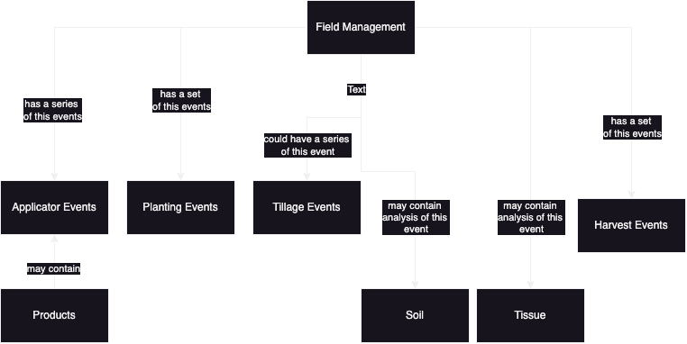
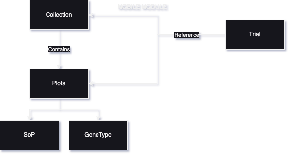
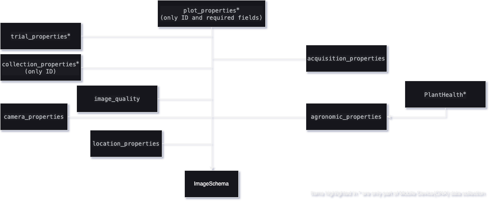

# AgDMALabs-open
## Structure of Field Management
This is how the field management entity is structured.

## Purpose and Structure of Arrangement of /open_aglabs/mobile
This is new directory serves to hold the metadata schemas that are relevant for smooth operation of ONA entity.

## Image Schema Entity for Mobile Data Collection
Image Schema entity can contain additional references to fields that are mentioned in *.
