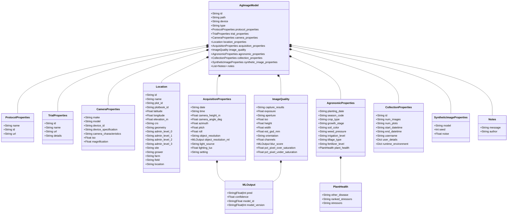
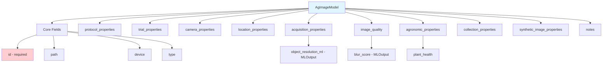

# AgDMALabs-open

## AgImageModel Entity Relationship Diagram

---

## ERD Diagram (Mermaid)

```mermaid
erDiagram
    AgImageModel {
        string id PK "Required - UUID4"
        string path "GCS/file path"
        string device "mobile|auxiliary_camera|drone|etc"
        string type "original|annotation|augmented|synthetic"
    }

    ProtocolProperties {
        string name "Protocol name"
        string id "Protocol identifier"
        string url "Documentation URL"
    }

    TrialProperties {
        string id "Trial unique ID"
        string name "Trial name"
        string url "Trial documentation URL"
        string details "Additional details"
    }

    CameraProperties {
        string make "Camera manufacturer"
        string model "Camera model"
        string device_id "Unique device ID"
        string device_specification "Device spec string"
        string camera_characteristics "Focal length, sensor, lens"
        float iso "ISO setting"
        float magnification "Zoom/magnification"
    }

    Location {
        string id "Location UUID"
        string name "Location name"
        string plot_id "Plot identifier"
        string plotbook_id "Plotbook reference"
        float latitude "GPS latitude (-90 to 90)"
        float longitude "GPS longitude (-180 to 180)"
        float elevation_m "Elevation in meters"
        string crs "Coordinate reference system"
        string geometry "WKT geometry"
        string admin_level_0 "Country"
        string admin_level_1 "State/Province"
        string admin_level_2 "County"
        string admin_level_3 "City/Town"
        string site "Research site"
        string grower "Grower name"
        string farm "Farm name"
        string field "Field ID"
        string location "BrAPI location"
    }

    AcquisitionProperties {
        string date "Capture date"
        string time "Capture time"
        float camera_height_m "Camera height (meters)"
        float camera_angle_deg "Camera angle (-180 to 180)"
        float azimuth "Azimuth angle"
        float pitch "Pitch angle"
        float roll "Roll angle"
        string object_resolution "Resolution description"
        string light_source "Light source type"
        float lighting_lux "Lux measurement (0-100000)"
        string setting "Capture setting/environment"
    }

    ImageQuality {
        string capture_results "Capture status"
        float exposure "Exposure value (1-100)"
        string aperture "Aperture setting"
        float iso "ISO value (0-100000)"
        float height "Image height (pixels)"
        float width "Image width (pixels)"
        float est_gsd_mm "Ground sample distance (mm)"
        string orientation "landscape|portrait"
        float channels "Number of channels"
        float pct_pixel_over_saturation "Over-saturated pixels %"
        float pct_pixel_under_saturation "Under-saturated pixels %"
    }

    AgronomicProperties {
        string planting_date "Planting date"
        string season_code "YYYY:Country:Crop:season"
        string crop_type "Crop from CROP_LIST"
        string growth_stage "Growth stage code"
        string soil_color "light|dark|red"
        string weed_pressure "high|medium|low scale"
        string irrigation_level "high|standard|low|none"
        string tillage_type "conventional|reduced|no-till"
        string fertilizer_level "high|standard|low"
    }

    PlantHealth {
        string other_disease "Non-standard disease"
        string ranked_stressors "Ranked stressor list"
        string stressors "Stressor from dropdown"
    }

    CollectionProperties {
        string id "Collection ID"
        string num_images "Image count"
        string num_plots "Plot count"
        string start_datetime "Collection start"
        string end_datetime "Collection end"
        string username "Collector username"
        dict user_details "User metadata"
        dict runtime_environment "App environment"
    }

    SyntheticImageProperties {
        string model "Generation model"
        int seed "Random seed"
        float noise "Noise level"
    }

    MLOutput {
        string pred "Prediction value"
        float confidence "Confidence score"
        string model_id "Model identifier"
        string model_version "Model version"
    }

    Notes {
        string message "Note content (required)"
        string author "Note author (required)"
    }

    %% Relationships
    AgImageModel ||--o| ProtocolProperties : "protocol_properties"
    AgImageModel ||--o| TrialProperties : "trial_properties"
    AgImageModel ||--o| CameraProperties : "camera_properties"
    AgImageModel ||--o| Location : "location_properties"
    AgImageModel ||--o| AcquisitionProperties : "acquisition_properties"
    AgImageModel ||--o| ImageQuality : "image_quality"
    AgImageModel ||--o| AgronomicProperties : "agronomic_properties"
    AgImageModel ||--o| CollectionProperties : "collection_properties"
    AgImageModel ||--o| SyntheticImageProperties : "synthetic_image_properties"
    AgImageModel ||--o{ Notes : "notes"

    AgronomicProperties ||--o| PlantHealth : "plant_health"
    AcquisitionProperties ||--o| MLOutput : "object_resolution_ml"
    ImageQuality ||--o| MLOutput : "blur_score"
```

---

## Class Diagram (Alternative View)

```mermaid
classDiagram
    class AgImageModel {
        +String id
        +String path
        +String device
        +String type
        +ProtocolProperties protocol_properties
        +TrialProperties trial_properties
        +CameraProperties camera_properties
        +Location location_properties
        +AcquisitionProperties acquisition_properties
        +ImageQuality image_quality
        +AgronomicProperties agronomic_properties
        +CollectionProperties collection_properties
        +SyntheticImageProperties synthetic_image_properties
        +List~Notes~ notes
    }

    class ProtocolProperties {
        +String name
        +String id
        +String url
    }

    class TrialProperties {
        +String id
        +String name
        +String url
        +String details
    }

    class CameraProperties {
        +String make
        +String model
        +String device_id
        +String device_specification
        +String camera_characteristics
        +Float iso
        +Float magnification
    }

    class Location {
        +String id
        +String name
        +String plot_id
        +String plotbook_id
        +Float latitude
        +Float longitude
        +Float elevation_m
        +String crs
        +String geometry
        +String admin_level_0
        +String admin_level_1
        +String admin_level_2
        +String admin_level_3
        +String site
        +String grower
        +String farm
        +String field
        +String location
    }

    class AcquisitionProperties {
        +String date
        +String time
        +Float camera_height_m
        +Float camera_angle_deg
        +Float azimuth
        +Float pitch
        +Float roll
        +String object_resolution
        +MLOutput object_resolution_ml
        +String light_source
        +Float lighting_lux
        +String setting
    }

    class ImageQuality {
        +String capture_results
        +Float exposure
        +String aperture
        +Float iso
        +Float height
        +Float width
        +Float est_gsd_mm
        +String orientation
        +Float channels
        +MLOutput blur_score
        +Float pct_pixel_over_saturation
        +Float pct_pixel_under_saturation
    }

    class AgronomicProperties {
        +String planting_date
        +String season_code
        +String crop_type
        +String growth_stage
        +String soil_color
        +String weed_pressure
        +String irrigation_level
        +String tillage_type
        +String fertilizer_level
        +PlantHealth plant_health
    }

    class PlantHealth {
        +String other_disease
        +String ranked_stressors
        +String stressors
    }

    class CollectionProperties {
        +String id
        +String num_images
        +String num_plots
        +String start_datetime
        +String end_datetime
        +String username
        +Dict user_details
        +Dict runtime_environment
    }

    class SyntheticImageProperties {
        +String model
        +Int seed
        +Float noise
    }

    class MLOutput {
        +String|Float|Int pred
        +Float confidence
        +String|Float model_id
        +String|Float|Int model_version
    }

    class Notes {
        +String message
        +String author
    }

    AgImageModel *-- ProtocolProperties
    AgImageModel *-- TrialProperties
    AgImageModel *-- CameraProperties
    AgImageModel *-- Location
    AgImageModel *-- AcquisitionProperties
    AgImageModel *-- ImageQuality
    AgImageModel *-- AgronomicProperties
    AgImageModel *-- CollectionProperties
    AgImageModel *-- SyntheticImageProperties
    AgImageModel *-- Notes

    AgronomicProperties *-- PlantHealth
    AcquisitionProperties *-- MLOutput
    ImageQuality *-- MLOutput
```

---

## Hierarchy Overview

```mermaid
graph TD
    A[AgImageModel] --> B[Core Fields]
    A --> C[protocol_properties]
    A --> D[trial_properties]
    A --> E[camera_properties]
    A --> F[location_properties]
    A --> G[acquisition_properties]
    A --> H[image_quality]
    A --> I[agronomic_properties]
    A --> J[collection_properties]
    A --> K[synthetic_image_properties]
    A --> L[notes]

    B --> B1[id - required]
    B --> B2[path]
    B --> B3[device]
    B --> B4[type]

    I --> I1[plant_health]
    G --> G1[object_resolution_ml - MLOutput]
    H --> H1[blur_score - MLOutput]

    style A fill:#e1f5fe
    style B1 fill:#ffcdd2
```

## Key Relationships

| Parent | Child | Cardinality | Description |
|--------|-------|-------------|-------------|
| AgImageModel | ProtocolProperties | 0..1 | Optional protocol metadata |
| AgImageModel | TrialProperties | 0..1 | Optional trial metadata |
| AgImageModel | CameraProperties | 0..1 | Optional camera metadata |
| AgImageModel | Location | 0..1 | Optional location metadata |
| AgImageModel | AcquisitionProperties | 0..1 | Optional acquisition metadata |
| AgImageModel | ImageQuality | 0..1 | Optional quality metrics |
| AgImageModel | AgronomicProperties | 0..1 | Optional agronomic data |
| AgImageModel | CollectionProperties | 0..1 | Optional collection metadata |
| AgImageModel | SyntheticImageProperties | 0..1 | Optional synthetic image data |
| AgImageModel | Notes | 0..* | Zero or more notes |
| AgronomicProperties | PlantHealth | 0..1 | Optional plant health data |
| AcquisitionProperties | MLOutput | 0..1 | Optional ML resolution prediction |
| ImageQuality | MLOutput | 0..1 | Optional ML blur score |

---

*Document generated: February 2026*
*Source: AgDMALabs-open/open_aglabs/image/models.py*
